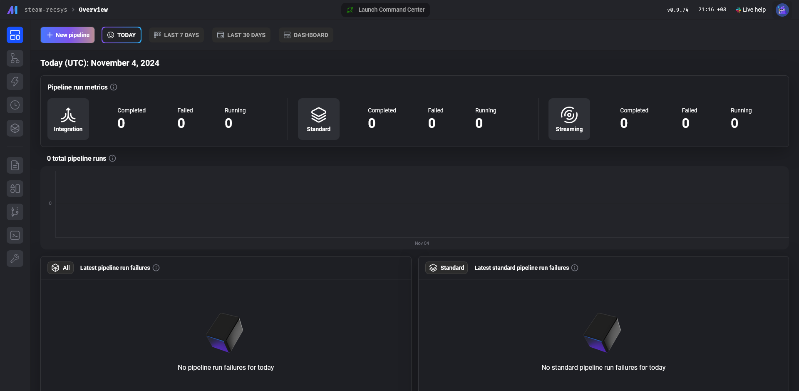
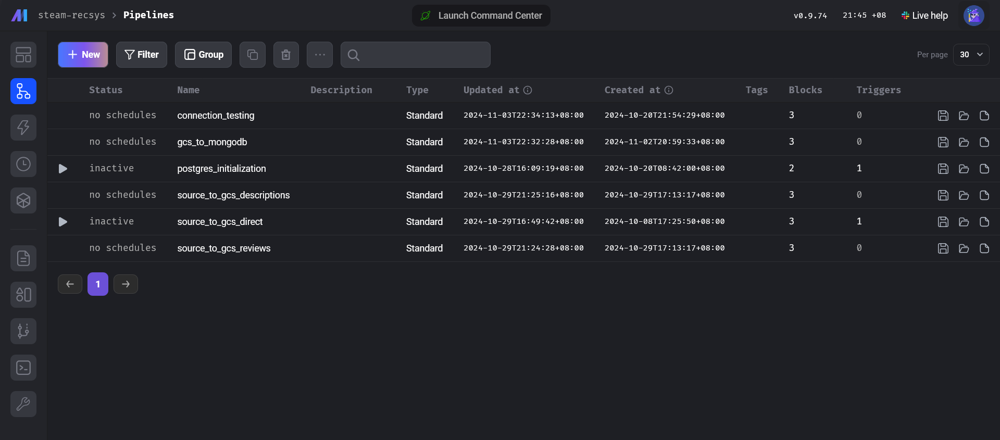
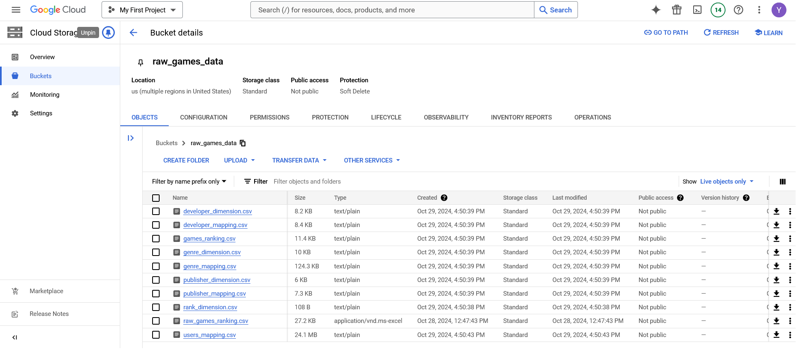
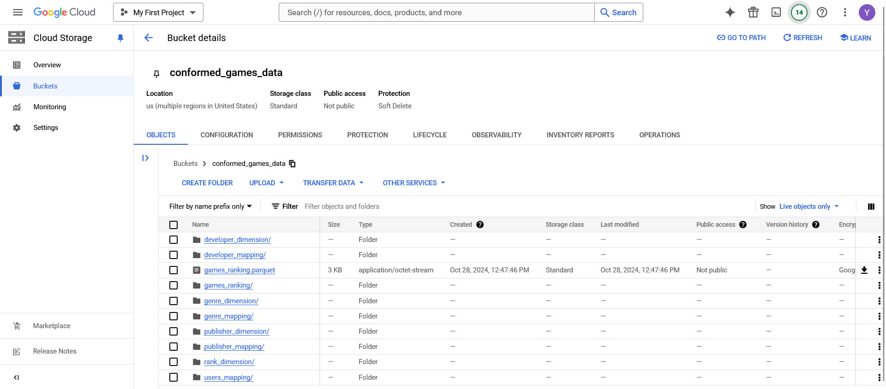
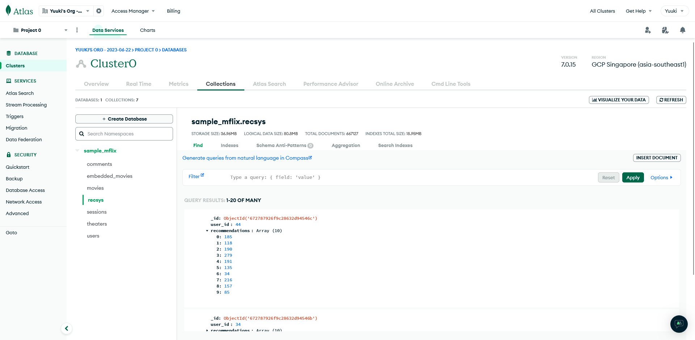

# 1. SteamDB-RecSys
This is a personal project to demonstrate how data pipelines for offline ML training and serving in a recommendation system will look like. The project uses game review data scraped from Steam. The original data came from [Kaggle](https://www.kaggle.com/datasets/mohamedtarek01234/steam-games-reviews-and-rankings/data). I modified them and uploaded to [HuggingFace re-upload mirror](https://huggingface.co/datasets/HangenYuu/Steam_Games_Review).

The project started on 04/10/2024, by a undergraduate student who loves learning about data engineering, distributed system, and recommendation system.

Accompany this project is a series blog posts consolidating the knowledge I learnt from industry best practices, published in my blog at https://hung.bearblog.dev/archive/. The particular posts are listed below.

- Part 1: Project Development - https://hung.bearblog.dev/recsysdev/
- Part 2: Recommendation System Storage and Compute (Offline Training) - https://hung.bearblog.dev/recsysoff/
- Part 3: Recommendation System Storage and Compute (Online Inference) - https://hung.bearblog.dev/recsyson/

**Table of Contents**

- [1. SteamDB-RecSys](#1-steamdb-recsys)
- [2. Technologies](#2-technologies)
- [3. Run the project](#3-run-the-project)
  - [3.1. Prepare the cloud credentials.](#31-prepare-the-cloud-credentials)
  - [3.2. Run the containers](#32-run-the-containers)
- [4. Project Development Details](#4-project-development-details)
- [5. Schematic Design](#5-schematic-design)
- [6. Blog posts on storage and compute components extending this project](#6-blog-posts-on-storage-and-compute-components-extending-this-project)

# 2. Technologies
- Python 3.10.10.
- [GitHub Codespace](https://github.com/codespaces/) and [Lightning AI Studio](https://lightning.ai/studios) for development environments.
- [Polars](https://pola.rs/) and [Pandas](https://pandas.pydata.org/) for data processing.
- [Mage](https://www.mage.ai/) for data pipeline definition & orchestration.
- [PostgreSQL](https://www.postgresql.org/) for SQL database.
- [Docker](https://www.docker.com/) for containerization.
- [Google Cloud Storage](https://cloud.google.com/storage) to create data lake.

# 3. Run the project
## 3.1. Prepare the cloud credentials.
1. Rename `dev.env` to `.env` and add PostgreSQL & MongoDB credentials to the environment variables file.
2. Sign up for Google Cloud Product trial and create a service account with appropriate role for Google CLoud Storage.
3. Download the service account key file and save it in the `data_pipeline` directory.
4. Navigate to the `data_pipeline/data` directory and run the `download.sh` script to download the data from HuggingFace to the folder.

## 3.2. Run the containers
1. Go to the correct working directory and initialize the containers.
```bash
git clone https://github.com/HangenYuu/Steam-RecSys.git
cd data_pipeline
# Build and start the containers
docker compose up -d --build
```
2. Navigate to http://localhost:6789/ to view the Mage UI.



3. Edit the `io-config.yaml` file in the IDE or the file in Mage UI. We need to set the correct credentials for GCP, PostgreSQL, and MongoDB.
```yaml
# Google
# Specify the path to the service account file
GOOGLE_SERVICE_ACC_KEY_FILEPATH: "/home/src/solid-acrobat-440004-g5-903ac2d18476.json"
GOOGLE_LOCATION: US # Optional
# MongoDB
# Specify the connection string or the (host, password, user, port) to connect to MongoDB using environment variables.
MONGODB_CONNECTION_STRING: "mongodb+srv://{{ env_var('MONGODB_USER') }}:{{ env_var('MONGODB_PASSWORD') }}@{{ env_var('MONGODB_HOST') }}/"
MONGODB_DATABASE: sample_mflix
MONGODB_COLLECTION: rec_results
# PostgresSQL
# Specify the credential to the PostgreSQL database using environment variables.
POSTGRES_CONNECT_TIMEOUT: 10
POSTGRES_DBNAME: {{ env_var('POSTGRES_DBNAME') }}
POSTGRES_SCHEMA: {{ env_var('POSTGRES_SCHEMA') }}
POSTGRES_USER: {{ env_var('POSTGRES_USER') }}
POSTGRES_PASSWORD: {{ env_var('POSTGRES_PASSWORD') }}
POSTGRES_HOST: {{ env_var('POSTGRES_HOST') }}
POSTGRES_PORT: {{ env_var('POSTGRES_PORT') }}
```
5. Go to "Pipelines" in Mage UI, you should see 6 pipelines:



- `connection_testing` is for testing the connections with GCS, PostgreSQL, and MongoDB.
- `postgres_initialization` is for initial ingestion of the data to PostgreSQL.
- `source_to_gcs_...` are for ingesting the data from PostgreSQL to GCS.
- `gcs_to_mongodb` are for ingesting the data from GCS to MongoDB.

6. Go to `connection_testing` and run the 3 cells to check for PostgreSQL & GCS connections.

7. Go to `postgres_initialization` and run the pipeline to ingest the data to the PostgreSQL database.

8. Use the notebook `notebooks\3. postgres_tables_check.ipynb` or `pgcli` to check if the data are all ingested to the PostgreSQL database.

9.  Go to the three `source_to_gcs_...` pipelines and run the pipeline to ingest the data from PostgreSQL to GCS. Double check for the data in GCS.





10. Go to the `gcs_to_mongodb` pipeline and run the pipeline to ingest the data from GCS to MongoDB. Double check for the data in MongoDB.



# 4. Project Development Details
Cover in the 1st blog post: https://hung.bearblog.dev/recsysdev/

# 5. Schematic Design


Based on this diagram, we need 2 main components:
1. **Low-cost high-volume storage** ([S3](https://aws.amazon.com/s3/), [ADLS](https://azure.microsoft.com/en-us/products/storage/data-lake-storage)) for data lake.
2. **Compute engine** ([Spark](https://spark.apache.org/), [Trino](https://trino.io/)) for batch processing.

There are other components such as
1. **Data connectors** ([dlt](https://dlthub.com/docs/intro)) or **data integration platform** ([Airbyte](https://airbyte.com/)) to connect and load the data from sources.
2. **Orchestration tools** ([Metaflow](https://metaflow.org/), [Vertex AI Pipelines](https://cloud.google.com/vertex-ai/docs/pipelines/introduction)) to orchestrate data and ML training pipelines and the underlying hardware.
3. **Low-latency key-value storage** ([ScyllaDB](https://www.scylladb.com/), [DynamoDB](https://aws.amazon.com/dynamodb/)) and **cache** ([Redis](https://redis.io/)) for serving the inference results.

# 6. Blog posts on storage and compute components extending this project

- Part 2: Recommendation System Storage and Compute (Offline Training) - https://hung.bearblog.dev/recsysoff/
- Part 3: Recommendation System Storage and Compute (Online Inference) - https://hung.bearblog.dev/recsyson/